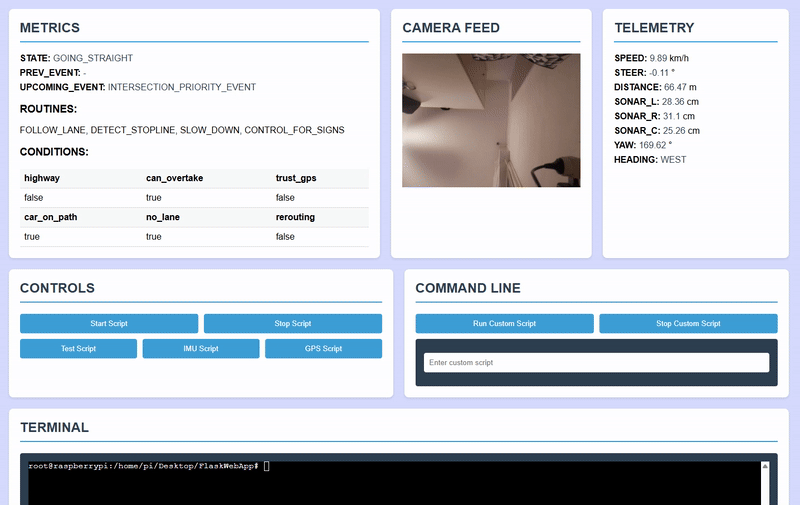

We need to run app.py as sudo (because to remove a socket file from the folder /tmp/ you need sudo) #TODO change the folder /tmp/ to a /sockets/
```bash
sudo su
```

If running in the venv activate the environment:
```bash
source venv/bin/activate
```
```bash
deactivate #to close environment
```

As sudo:
run client.py (reads the camera feed and send it on the unix socket)
run socket_metrics_send.py (simulate part of data from the main_brain code)
run app.py 

### Note 
Modify the ip inside the app.py to corespond to your local IP, or just put localhost if you test on the host.

### Demo 

